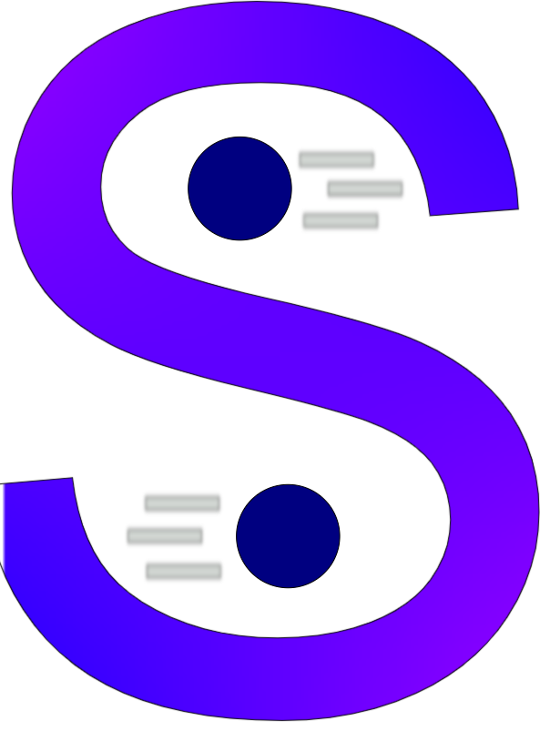

# Sharp #

(Formerly SharpPhysics)

## SUMMARY ##

---------------------------------------------------------

Sharp is a (somewhat small and 2d) physics/rendering library set up with Silk.net with OpenGL.

## NOTICE ##

---------------------------------------------------------
Sharp is under heavy development!!!
It should not be used in any production projects!

## BUILDING ##

---------------------------------------------------------

To build, do all the normal things to build, and make sure to copy over all .glsl files to [output directory]\Shaders.

## PLATFORM SUPPORT ##

---------------------------------------------------------

Sharp runs on Windows, Mac, and Linux.  
NOTE: Because of ImGuiNet, Sharp is unable to run on any arm64 device.

## RECENT UPDATES ##

---------------------------------------------------------

Renamed to Sharp

## PACKAGES ##

---------------------------------------------------------

This program makes use of four (.5) libaries, they are:  
Newtonsoft.Json  
Silk.Net (I'm using OpenGL through Silk.Net)  
StbImageSharp  
GLFW (Written in C)  
SDL (Writtrn in C)  

None of these were made by me.
