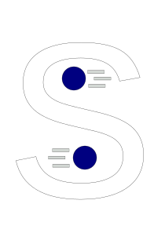

# SharpPhysics #

## SUMMARY ##

---------------------------------------------------------

SharpPhysics is a (somewhat small and 2d) physics/rendering library set up with Silk.net with OpenGL.

## NOTICE ##

---------------------------------------------------------
SharpPhysics is under heavy development!!!
It should not be used in any production projects!

## BUILDING ##

---------------------------------------------------------

To build, do all the normal things to build, and make sure to copy over all .glsl files to [output directory]\Shaders,
and also copy over glfw.dll to the output directory.

## PLATFORM SUPPORT ##

---------------------------------------------------------

SharpPhysics runs on Windows, Mac, and Linux.  
NOTE: Because of ImGuiNet, SharpPhysics is unable to run on arm64.

## RECENT UPDATES ##

---------------------------------------------------------

I just finished most of the UI stuff, I'll come back to it though.
What I'm doing next: Making test game

## PACKAGES ##

---------------------------------------------------------

This program makes use of four libaries, they are:
Newtonsoft.Json
Silk.Net
StbImageSharp
GLFW (Written in C)
SDL (Writtrn in C)
FontStashSharp.

None of these were made by me.
